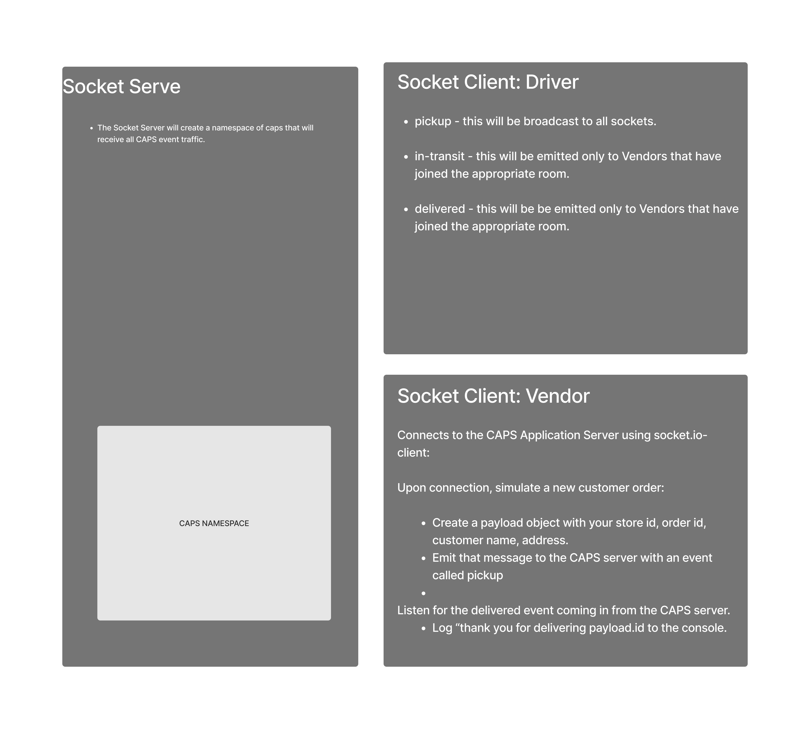

# LAB - Class 11

## Project: Event Programming

### Authors: Joe Davitt

### Problem Domain

Create a caps system with socket.io

### Links and Resources

[Actions](https://github.com/jeremy-cleland/CAPS/actions)

### Setup

#### `.env` requirements (where applicable)

no env requirements

#### How to initialize/run your application (where applicable)

- e.g. `npm start`

#### UML

